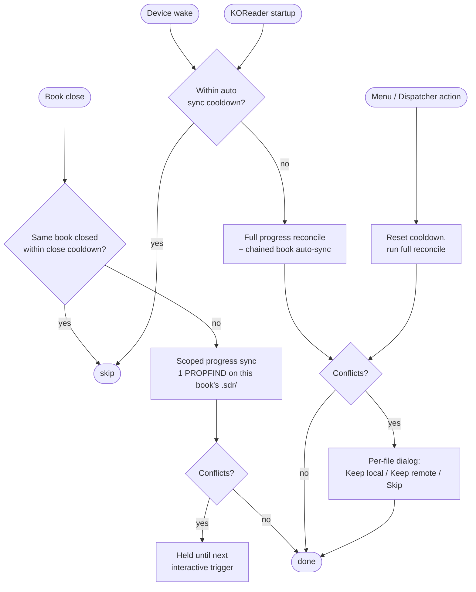

# WebDAV Auto Sync – KOReader Plugin

Sync files from a WebDAV server to your device. Optional credentials, configurable download folder, and either automatic sync on startup or manual sync on demand.

## Features

- **WebDAV connection** – Server URL with optional username/password (Basic auth).
- **Import from KOReader cloud storage** – If you already configured a WebDAV server under KOReader's built-in *Cloud storage* feature, pick it from KOReader's own picker (which also lets you choose a folder inside the server) and the URL and credentials are copied over automatically. The local download folder is always chosen separately.
- **Download folder** – Opens KOReader’s file explorer; navigate and long-press a folder to select it (no typing paths).
- **File extensions (optional)** – Sync only files with given extensions (e.g. `epub, pdf, txt`). Leave empty to sync all formats KOReader supports (EPUB, PDF, DjVu, XPS, CBT, CBZ, CB7, FB2, PDB, TXT, HTML, RTF, CHM, DOC, MOBI, ZIP, MD).
- **Auto sync triggers (granular, opt-in)** – Each automatic trigger is its own toggle, all grouped in the **Auto sync triggers** submenu and gated by a master switch:
  - *Enable auto sync* – master on/off. When off, none of the triggers below fire (manual sync still works). When off, the per-event toggles below appear greyed out.
  - *Sync books on startup* / *Sync books on wake* – run book sync at KOReader startup and/or after the device wakes from sleep. File-manager context only.
  - *Sync reading progress on startup* / *on wake* / *on book close* – run progress sync at startup, on wake, and/or after closing a book. Startup and wake reconcile the whole library; the book-close trigger pushes only the just-closed book (one network request) and silently defers any conflict to the next startup/wake.
  - *Auto sync cooldown* – minimum seconds between auto-triggered full reconciles (wake / startup). Manual syncs always run regardless. Default 300 s, range 0–1800 s. Set to 0 to disable.
  - *Close-trigger sync cooldown* – minimum seconds between two consecutive close-trigger syncs of the *same* book. Closing a *different* book always runs regardless. Default 30 s, range 0–600 s. Set to 0 to disable.
  - *Wake settle delay* – how long to wait after the device wakes before starting an auto-sync. Filters brief system wakes (RTC alarms, hall-sensor twitches, framework background tasks) so they don't burn the cooldown. Default 15 s, range 0–60 s. Set to 0 to run inline on wake (pre-1.7.8 behavior).
- **Manual sync** – Use **Sync books now** or **Sync reading progress now** from the menu at any time. Both actions are also exposed in the Dispatcher (`WebDAV sync books now`, `WebDAV sync reading progress now`), so you can bind them to a gesture, profile, or reader-top toolbar button. Manual entries bypass both the master and the per-event toggles.
- **Two-way book sync (optional)** – When enabled, book sync also uploads new or changed local files back to the server. Affects book sync only — reading-progress sync is always bidirectional. Uses a small state cache to detect what changed since the last sync, so re-runs only transfer files that actually moved. Conflicts (a file changed on both sides) surface as a per-file dialog at the next interactive moment (manual sync, startup, or wake) — silent triggers leave them pending. Deletions are never propagated.
- **Reading-progress sync** – When the relevant per-event toggles are on, the plugin keeps each book's `.sdr` sidecar (last reading position, bookmarks, highlights, custom metadata, custom cover) in sync across devices via the same WebDAV server. Requires KOReader's *Document → Metadata folder* to be set to *Book folder* (the default), since only that mode places sidecars next to books.
- **Live library refresh** – After a sync writes files locally, the file browser, history, and collections views redraw automatically. New books appear and reading-progress badges (percent finished, status) update without needing to navigate away and back. Works for both book sync and reading-progress sync.

## How auto sync triggers work

**Reading the diagram:**

- The four entry points on the left are the only things that ever start a sync. There is **no** sync triggered by Suspend or by reading position changes — only by the events shown.
- **Each automatic entry point is its own toggle** (in *Auto sync triggers*) and is gated by the master *Enable auto sync* switch. With the master off (or that specific event toggle off), the corresponding arrow into the diagram is dead — the event simply doesn't enter the flow. Manual entries always run regardless.
- **Close** is cheap (one network request, scoped to the just-closed book) and has its own short cooldown — separate from the wake/startup one. Closing book A then book B fires twice (different `.sdr/`); closing book A then book A again within the close cooldown is debounced.
- **Wake** and **Startup** share the auto sync cooldown — they're the catch-up moments when full library reconciles happen and any held conflicts are surfaced. At each, only the syncs whose toggles are on actually run; if both *progress* and *books* on-startup are on, progress runs first and books chain after.
- **Manual** triggers always run, and they reset the auto sync cooldown so a wake/startup trigger right after won't fire redundantly. Manual does not reset the close cooldown.
- **Wake has a settle delay before the sync UI appears** (configurable via *Wake settle delay*, default 15 s). The device's framework can wake the CPU briefly for its own background tasks (RTC alarms, leather-cover hall sensor twitching, Wi-Fi housekeeping) without the user actually picking the device up; the delay lets those go back to sleep without burning a sync. On Kindle the plugin reads the framework's own wake classification at the end of the delay; on other platforms it relies on the device re-suspending before the timer fires. Real wakes proceed as normal once the delay elapses. Startup, close, and manual triggers are not delayed. Set the delay to 0 to disable the gate entirely (sync runs immediately on wake).
- **Auto triggers run silently — popup only when something needs attention.** Startup, wake, and book-close all skip the "Syncing…" indicator and skip the success summary. A summary popup appears only when something failed. Conflict prompts appear regardless (they need your input). Plan-level failures (server unreachable, auth rejected) always surface so you know the sync didn't run.
- **Manual triggers always show the full UI** — the "Syncing…" indicator during the run AND the summary popup at the end, regardless of outcome. You explicitly asked, so you get feedback.
- **When startup or wake runs both reading-progress AND book sync together**, the merged failure popup (if any) lists each sync on its own line, with any per-file failures listed once at the bottom.
- The two cooldowns are independent: a close-triggered sync does not push back the next wake/startup reconcile, and vice versa. Defaults are **300 s** for wake/startup (*Auto sync cooldown*) and **30 s** for the close trigger (*Close-trigger sync cooldown*); both are in the *Auto sync triggers* submenu, both accept 0 to disable.
- Cooldown timestamps are persisted across KOReader restarts (in the plugin's state file alongside the per-file sync cache), so killing and reopening KOReader within the cooldown window won't bypass it.
- Conflicts produced by a silent close are stored without dialog and shown the next time an interactive trigger runs.

## Installation

1. Download or clone this repo so the plugin folder is named `webdav-autosync.koplugin`.
2. Copy the whole `webdav-autosync.koplugin` folder into your KOReader plugins directory (e.g. `koreader/plugins/`).
3. Restart KOReader; the plugin appears in the main menu as **WebDAV Sync**.

## Usage

1. Open the main menu → **WebDAV Sync**.
2. **Set server URL** – Your WebDAV base URL (e.g. `https://example.com/webdav`). You can skip this step and use **Import from KOReader cloud storage** to copy the URL and credentials from a server you already configured under KOReader's built-in cloud storage; you'll be able to drill into a specific subfolder during the pick.
3. **Set credentials (optional)** – Username and password if the server requires auth.
4. **Choose download folder** – Opens the file browser; navigate to a folder and long-press it to select it as the download location.
5. **Set file extensions (optional)** – Comma- or space-separated list (e.g. `epub, pdf, txt`). Leave empty to sync all KOReader-supported formats.
6. **Two-way book sync (upload local changes)** – Turn on to also push local changes back to the server. The very first run after enabling silently establishes a baseline of files already present on both sides (no transfers, no conflicts). Subsequent runs upload anything new or modified locally and download anything new or modified remotely. Applies only to book sync — progress sync is always bidirectional.
7. **Auto sync triggers** – Open the submenu and:
   - Flip **Enable auto sync** on (master). The per-event toggles only take effect with the master on.
   - Toggle the events you want: **Sync books on startup**, **Sync books on wake**, **Sync reading progress on startup**, **Sync reading progress on wake**, **Sync reading progress on book close**. Each is independent; e.g. you can have only "on book close" on if you don't want library-wide reconciles.
   - **Auto sync cooldown** – minimum gap between auto-triggered full reconciles, i.e. wake / startup (default 300 s, 0 disables). Manual syncs always run regardless.
   - **Close-trigger sync cooldown** – minimum gap between two consecutive close-trigger syncs of the same book (default 30 s, 0 disables). Closing a *different* book always runs regardless.
8. **Sync books now** – Run a full book-file sync manually (lists all files on the server, downloads matching ones into the chosen folder; with two-way on, also uploads local changes).
9. **Sync reading progress now** – Reconcile `.sdr` sidecars on demand without waiting for an event trigger.
10. **Help** – Open an in-app reference of what each menu item does and how to set it up.

Sync downloads **all files** under the server URL recursively; subfolders are recreated under the download folder.

### Two-way sync details

- The same extension filter applies to uploads — only book files are pushed.
- A small state cache (`<settings_dir>/webdav_autosync_state.lua`) tracks per-file fingerprints so unchanged files are skipped on every run. Progress sync shares this same cache.
- **Conflicts** (a file changed on both sides since the last sync): you'll be asked per file to *Keep local (upload)*, *Keep remote (download)*, or *Skip*. The dialog appears on manual sync, at KOReader startup, and on wake-from-sleep. Conflicts that arise during a book-close sync are simply held until the next interactive moment, so you'll never get a dialog while you're closing a book.
- **No deletions**: removing a file on one side does not delete it on the other. The plugin remembers the deletion so it doesn't keep re-syncing the file back.

### Reading-progress sync details

- Syncs every file inside any `<book>.sdr/` directory under the download folder — typically `metadata.<ext>.lua` (last reading position, bookmarks, highlights), plus `custom_metadata.lua` and any custom cover image.
- **Triggers** (see the [flow diagram](#how-auto-sync-triggers-work) above for the full picture):
  - *Book close*: silent on success. Scoped — only one PROPFIND on the just-closed book's `.sdr/`, not a full library walk. Per-book debounce: closing a different book always fires; closing the same book twice within the close-trigger cooldown (default 30 s) is debounced. Conflicts pop the per-file dialog immediately (1.8.0+); failures pop a summary at the end.
  - *Device wake*, *KOReader startup*: silent on success, full library reconcile. Conflicts surface as a dialog chain regardless; failures surface as a summary popup.
  - *Manual* (menu item or Dispatcher action): full UI at any time — "Syncing…" indicator and a summary popup. Bypasses the debounce, prompts to enable Wi-Fi if it's off.
  - There is no Suspend trigger — the close trigger already pushed the just-edited book, so a full walk during suspend is redundant and a needless hit on the server's rate limit.
- **Sidecar location**: requires KOReader's *Document → Metadata folder* setting to be *Book folder* (the default). Other modes place sidecars outside the synced library tree, so they cannot be mapped to a remote path; the plugin silently skips them in that case.
- **Same WebDAV root** as book sync — no separate server or credentials.
- **Network**: silent triggers and auto interactive triggers no-op when offline (no Wi-Fi prompt during close/wake/startup). Manual sync prompts to enable Wi-Fi if needed.
- **Device-specific paths inside sidecars are normal.** A freshly downloaded `metadata.<ext>.lua` will still show the source device's `doc_path` and a `-- /…/metadata.<ext>.lua` header comment pointing at the source device's filesystem. KOReader rewrites both on the first open of the book on the destination device, so reading position, bookmarks, highlights, etc. all consume cleanly — the stale paths are cosmetic. The plugin deliberately does not edit sidecar contents in flight.

## Troubleshooting

Every log line emitted by the plugin starts with `webdav_autosync:`, so a single `grep webdav_autosync /path/to/koreader/crash.log` surfaces the full trail. By default you'll see info-level entries — trigger names (`trigger=close|resume|startup|manual_*`), sync start, and sync done with counts. Enable **Tools → More tools → Developer options → Enable debug logging** before reproducing to also capture per-file diff decisions, per-action HTTP outcomes, gating reasons (cooldown, toggle off, offline, brief unscheduled wake, etc.), and individual WebDAV requests.

If you suspect the wake trigger is being suppressed too aggressively, the relevant debug lines are `trigger=resume defer secs=15` (sync deferred), `trigger=resume cancelled reason=suspend` (device went back to sleep before the delay elapsed), and `trigger=resume skip reason=unscheduled-wake state=…` (Kindle: framework reported the wake was a brief system one). A real user wake will instead reach `trigger=resume progress=… books=…` after the 15 s delay.

## Requirements

- KOReader with LuaSocket (and HTTPS support for `https://` URLs).
- A WebDAV server that supports PROPFIND and GET.

## Files

- `_meta.lua` – Plugin manifest.
- `main.lua` – Entry point, menu, settings, auto/manual sync, lifecycle event handlers, conflict dialog.
- `webdav.lua` – WebDAV client (PROPFIND, GET, PUT, MKCOL; Basic auth).
- `sync.lua` – One-way book sync (`run_sync`), two-way book sync (`plan`), two-way progress sync (`plan_progress`), with shared `do_action` / `save_cache` and a single state cache.

## License

MIT.
