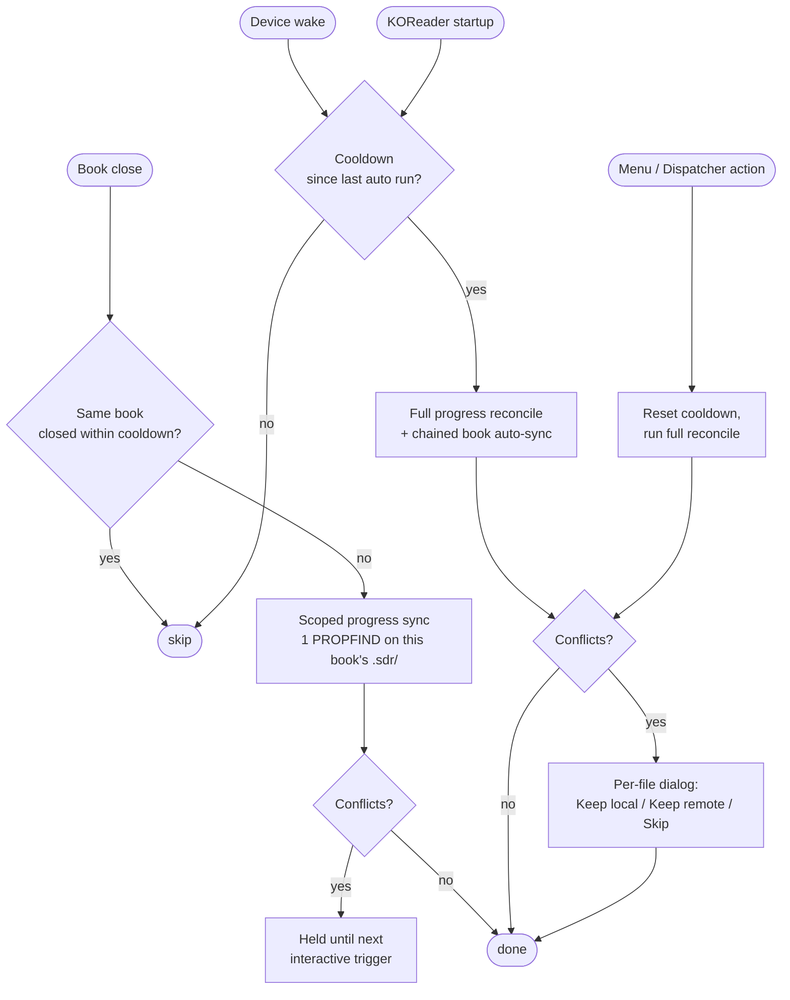

# WebDAV Auto Sync – KOReader Plugin

Sync files from a WebDAV server to your device. Optional credentials, configurable download folder, and either automatic sync on startup or manual sync on demand.

## Features

- **WebDAV connection** – Server URL with optional username/password (Basic auth).
- **Import from KOReader cloud storage** – If you already configured a WebDAV server under KOReader's built-in *Cloud storage* feature, pick it from KOReader's own picker (which also lets you choose a folder inside the server) and the URL and credentials are copied over automatically. The local download folder is always chosen separately.
- **Download folder** – Opens KOReader’s file explorer; navigate and long-press a folder to select it (no typing paths).
- **File extensions (optional)** – Sync only files with given extensions (e.g. `epub, pdf, txt`). Leave empty to sync all formats KOReader supports (EPUB, PDF, DjVu, XPS, CBT, CBZ, CB7, FB2, PDB, TXT, HTML, RTF, CHM, DOC, MOBI, ZIP, MD).
- **Auto-sync books** – When enabled, book sync runs at KOReader startup and on wake-from-sleep (debounced).
- **Manual sync** – Use **Sync books now** from the menu to pull all files at any time. The action is also exposed as `WebDAV sync books now` in the Dispatcher, so you can bind it to a gesture, profile, or reader-top toolbar button.
- **Two-way book sync (optional)** – When enabled, book sync also uploads new or changed local files back to the server. Affects book sync only — reading-progress sync is always bidirectional. Uses a small state cache to detect what changed since the last sync, so re-runs only transfer files that actually moved. Conflicts (a file changed on both sides) surface as a per-file dialog at the next interactive moment (manual sync, startup, or wake) — silent triggers leave them pending. Deletions are never propagated.
- **Auto-sync reading progress (optional, opt-in)** – When enabled, the plugin keeps each book's `.sdr` sidecar (last reading position, bookmarks, highlights, custom metadata, custom cover) in sync across devices via the same WebDAV server. Triggered automatically on book close (silent — pushes only the just-closed book, one network request), and on wake and KOReader startup (interactive, full library reconcile — pending conflicts surface as a dialog). All auto triggers share a configurable cooldown (default 120 s, settable from the menu) to keep WebDAV load down, but closing a *different* book always runs anyway since each book's sidecar is independent. Also reachable manually via **Sync reading progress now** in the menu or the `WebDAV sync reading progress now` Dispatcher action (bind it to a gesture or toolbar slot). Requires KOReader's *Document → Metadata folder* to be set to *Book folder* (the default), since only that mode places sidecars next to books.
- **Configurable auto-sync cooldown** – The minimum gap between auto-triggered syncs is exposed in the menu (**Auto sync cooldown**). Default 120 s, range 0–1800 s. Set to 0 to disable the cooldown entirely.
- **Live library refresh** – After a sync writes files locally, the file browser, history, and collections views redraw automatically. New books appear and reading-progress badges (percent finished, status) update without needing to navigate away and back. Works for both book sync and reading-progress sync.

## How auto sync triggers work

**Reading the diagram:**

- The four entry points on the left are the only things that ever start a sync. There is **no** sync triggered by Suspend or by reading position changes — only by the events shown.
- **Close** is cheap (one network request, scoped to the just-closed book) and has its own per-book gate. Closing book A then book B fires twice; closing book A then book A again within the cooldown only fires once.
- **Wake** and **Startup** share the global cooldown — they're the catch-up moments when full library reconciles happen and any held conflicts are surfaced.
- **Manual** triggers always run, and they reset the cooldown so an auto trigger right after won't fire redundantly.
- The cooldown defaults to **120 seconds** but is configurable from the menu (**Auto sync cooldown**). Set it to 0 to disable the cooldown entirely.
- Conflicts produced by a silent close are stored without dialog and shown the next time an interactive trigger runs.

## Installation

1. Download or clone this repo so the plugin folder is named `webdav-autosync.koplugin`.
2. Copy the whole `webdav-autosync.koplugin` folder into your KOReader plugins directory (e.g. `koreader/plugins/`).
3. Restart KOReader; the plugin appears in the main menu as **WebDAV Sync**.

## Usage

1. Open the main menu → **WebDAV Sync**.
2. **Set server URL** – Your WebDAV base URL (e.g. `https://example.com/webdav`). You can skip this step and use **Import from KOReader cloud storage** to copy the URL and credentials from a server you already configured under KOReader's built-in cloud storage; you'll be able to drill into a specific subfolder during the pick.
3. **Set credentials (optional)** – Username and password if the server requires auth.
4. **Choose download folder** – Opens the file browser; navigate to a folder and long-press it to select it as the download location.
5. **Set file extensions (optional)** – Comma- or space-separated list (e.g. `epub, pdf, txt`). Leave empty to sync all KOReader-supported formats.
6. **Auto-sync books** – Turn on to sync book files automatically when KOReader starts and when the device wakes from sleep.
7. **Two-way book sync (upload local changes)** – Turn on to also push local changes back to the server. The very first run after enabling silently establishes a baseline of files already present on both sides (no transfers, no conflicts). Subsequent runs upload anything new or modified locally and download anything new or modified remotely. Applies only to book sync — progress sync is always bidirectional.
8. **Auto-sync reading progress** – Turn on to keep `.sdr` sidecars in sync across devices automatically. Pushes happen on book close (one PROPFIND, scoped to that book); full reconcile and conflict prompts happen on wake and at startup.
9. **Auto sync cooldown** – Adjust the minimum gap between auto-triggered syncs. Default 120 s. 0 disables the cooldown.
10. **Sync books now** – Run a full book-file sync manually (lists all files on the server, downloads matching ones into the chosen folder; with two-way on, also uploads local changes).
11. **Sync reading progress now** – Reconcile `.sdr` sidecars on demand without waiting for an event trigger.
12. **Help** – Open an in-app reference of what each menu item does and how to set it up.

Sync downloads **all files** under the server URL recursively; subfolders are recreated under the download folder.

### Two-way sync details

- The same extension filter applies to uploads — only book files are pushed.
- A small state cache (`<settings_dir>/webdav_autosync_state.lua`) tracks per-file fingerprints so unchanged files are skipped on every run. Progress sync shares this same cache.
- **Conflicts** (a file changed on both sides since the last sync): you'll be asked per file to *Keep local (upload)*, *Keep remote (download)*, or *Skip*. The dialog appears on manual sync, at KOReader startup, and on wake-from-sleep. Conflicts that arise during a book-close sync are simply held until the next interactive moment, so you'll never get a dialog while you're closing a book.
- **No deletions**: removing a file on one side does not delete it on the other. The plugin remembers the deletion so it doesn't keep re-syncing the file back.

### Reading-progress sync details

- Syncs every file inside any `<book>.sdr/` directory under the download folder — typically `metadata.<ext>.lua` (last reading position, bookmarks, highlights), plus `custom_metadata.lua` and any custom cover image.
- **Triggers** (see the [flow diagram](#how-auto-sync-triggers-work) above for the full picture):
  - *Book close*: silent. Scoped — only one PROPFIND on the just-closed book's `.sdr/`, not a full library walk. Per-book debounce: closing a different book always fires; closing the same book twice within 120 s is debounced.
  - *Device wake*, *KOReader startup*: interactive, full library reconcile. Held conflicts surface as a dialog chain.
  - *Manual* (menu item or Dispatcher action): interactive at any time, bypasses the debounce, prompts to enable Wi-Fi if it's off.
  - There is no Suspend trigger — the close trigger already pushed the just-edited book, so a full walk during suspend is redundant and a needless hit on the server's rate limit.
- **Sidecar location**: requires KOReader's *Document → Metadata folder* setting to be *Book folder* (the default). Other modes place sidecars outside the synced library tree, so they cannot be mapped to a remote path; the plugin silently skips them in that case.
- **Same WebDAV root** as book sync — no separate server or credentials.
- **Network**: silent triggers and auto interactive triggers no-op when offline (no Wi-Fi prompt during close/wake/startup). Manual sync prompts to enable Wi-Fi if needed.
- **Device-specific paths inside sidecars are normal.** A freshly downloaded `metadata.<ext>.lua` will still show the source device's `doc_path` and a `-- /…/metadata.<ext>.lua` header comment pointing at the source device's filesystem. KOReader rewrites both on the first open of the book on the destination device, so reading position, bookmarks, highlights, etc. all consume cleanly — the stale paths are cosmetic. The plugin deliberately does not edit sidecar contents in flight.

## Requirements

- KOReader with LuaSocket (and HTTPS support for `https://` URLs).
- A WebDAV server that supports PROPFIND and GET.

## Files

- `_meta.lua` – Plugin manifest.
- `main.lua` – Entry point, menu, settings, auto/manual sync, lifecycle event handlers, conflict dialog.
- `webdav.lua` – WebDAV client (PROPFIND, GET, PUT, MKCOL; Basic auth).
- `sync.lua` – One-way book sync (`run_sync`), two-way book sync (`plan`), two-way progress sync (`plan_progress`), with shared `do_action` / `save_cache` and a single state cache.

## License

MIT.
